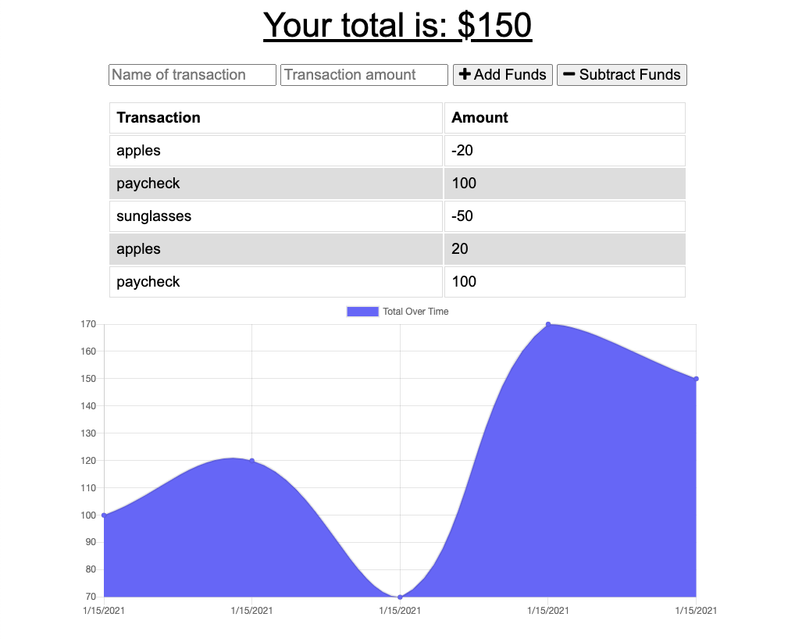

# Budget Tracker

The Budget Tracker app allows users to manage their expenses by adding and subtracting funds to a virtual account. The site features a log and chart to display all transactions made.

The focus of this project was to create a progressive web app by utilizing a service worker, web manifest, and cache API. The Budget Tracker is downloadable on mobile and desktop. Using the app offline will store pending transactions in a cache until the user is online. Once online, all pending transactions are stored in a [MongoDB](https://www.mongodb.com/) instance hosted by [Atlas](https://www.mongodb.com/cloud/atlas).

## Usage

Visit the deployed [Budget Tracker](https://budget-tracker-gt-pt.herokuapp.com/).

## Installation

1. Head over to the [project repository](https://github.com/roccomaniscalco/budget-tracker)
2. Press the green 'code' button and select method of download
3. Install and start [MongoDB](https://www.mongodb.com/) on your local machine
4. Open the repo in your text editor of choice
5. Run `npm install` then `npm start`

## Credits

- [Atlas](https://www.mongodb.com/cloud/atlas)
- [Compression](https://www.npmjs.com/package/compression)
- [Express](https://www.npmjs.com/package/express)
- [IndexedDB](https://developer.mozilla.org/en-US/docs/Web/API/IndexedDB_API)
- [Mongoose](https://www.npmjs.com/package/mongoose)
- [MongoDB](https://www.mongodb.com/)

## License

Licensed under the [MIT](https://opensource.org/licenses/MIT) license.
